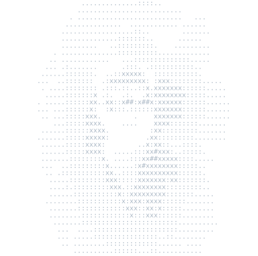
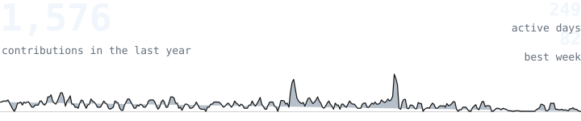
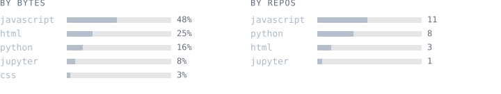
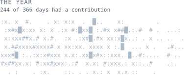

<div align="center">





[iamjustk.site](https://iamjustk.site) &nbsp;·&nbsp; [email](mailto:kartikey.sharma@codevidhya.com) &nbsp;·&nbsp; [github](https://github.com/Kartikeysharma1972)

</div>

```text
about
─────
AI/ML engineer, India. I build production AI agents and RAG systems, and
ship full-stack products around them. Small, sharp tools over big vague
ideas: I build fast, test on real users, and cut what doesn't earn its keep.
Right now that's EdTech AI tutors and multi-agent LangGraph systems.
```

```text
stack
─────
python   typescript   javascript   react   node   express   mongodb
langgraph   openai   groq   rag   docker   git   linux
```

```text
projects
────────
Ai-Tutor · react, express, mongodb, groq
  AI EdTech tutor for CBSE classes 1-12. Grade-adaptive concept explainer,
  document summariser, mock tests and focus-area analysis.

Classroom-Ai-Package · node, python, openai
  K-12 platform: teacher lesson/worksheet/assessment generation plus a
  960-topic grade-adaptive student tutor.

FinanceIQ · javascript, langgraph
  Personal finance analyst. Reads bank statements, categorises spend and
  builds a personalised financial roadmap with LangGraph agents.

Multi-Agent-Customer-support · python, langgraph
  Four specialised agents (billing / technical / returns / general) with
  automatic routing and human escalation.
```

<div align="center">





</div>

```text
about this page
───────────────
Every graphic here is generated, not embedded from anyone else's server.
ascii.svg is my avatar pushed through a character ramp; stats.svg, langs.svg
and year.svg are drawn straight from the GitHub GraphQL API by a scheduled
action, once a day, committing only what changed. The typeface is JetBrains
Mono, subset to the characters each graphic draws and inlined as base64, so
the page renders identically everywhere and never rate-limits or goes dark.
year.svg uses the portrait's ramp:  . : x # █ , quiet to loud.
```
